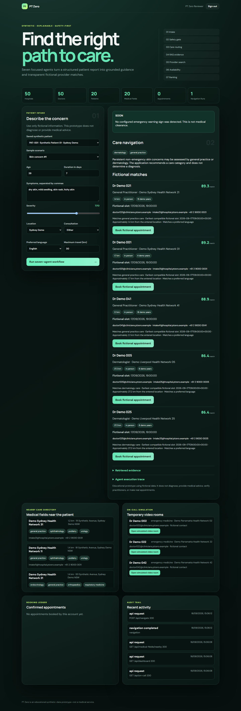

# PT Zero — Explainable Multi-Agent Care Navigation

PT Zero is a full-stack educational operations MVP that turns a structured, fictional
patient report into grounded care-category guidance and transparent fictional
provider matches. Seven narrow agents collaborate behind a deterministic safety
gate, and every decision is visible in an execution trace.

> **Synthetic-only:** PT Zero does not diagnose, provide medical advice, verify
> practitioners, or make real appointments. All patient, provider, hospital,
> address, and availability records are fictional.

**Live demo:** <https://pt-zero-care-navigation.onrender.com>



## Live product flow

```text
Authenticated web form
  → IntakeAgent
  → SafetyAgent ─── warning sign? ───→ stop ranking + emergency message
  → SpecialtyAgent
  → KnowledgeAgent (local RAG + citations)
  → ProviderAgent (SQLite + Haversine distance)
  → AvailabilityAgent
  → RankingAgent (explainable weighted score)
  → Results + evidence + complete trace
```

## Highlights

- Responsive patient-facing interface
- Argon2 password hashing
- Revocable, opaque server-side sessions
- `HttpOnly`, `SameSite=Strict`, deployment-secure cookies
- Double-submit and server-validated CSRF protection
- Protected provider and navigation APIs
- Constrained-random synthetic patient generator
- SQLite doctor, hospital, patient, user, session, appointment, navigation, and audit data
- 50 fictional hospitals, 50 fictional doctors, and 20 fictional patients
- Nearby medical-field directory with distance and fictional work contacts
- Transactional fictional appointment booking and appointment ledger
- Database-backed activity logging without request bodies or credentials
- Clearly labeled temporary on-call video-room simulation
- Local inspectable RAG with source evidence
- Emergency workflow termination before provider ranking
- Distance, availability, language, accessibility, and specialty ranking
- Unit, integration, authentication, security, and API tests
- Reproducible quality and latency benchmark
- Docker, GitHub Actions, GHCR publishing, and Render blueprint
- Automated ~30-second Playwright video recorder

## Quick start

```powershell
Set-Location -LiteralPath "V:\Portfolio\AI health\PT_Zero"
docker compose up --build
```

Open:

- Application: <http://localhost:8000>
- Interactive API: <http://localhost:8000/docs>
- Health check: <http://localhost:8000/api/health>

Create a fictional demo account using a password of at least 12 characters.
Stop with `Ctrl+C`, then run `docker compose down`.

## Test suite

```powershell
docker compose run --rm pt-zero python -m unittest discover -s tests -v
```

The tests cover:

- Registration, login, duplicate accounts, and logout
- Authentication requirements on protected endpoints
- CSRF rejection and successful protected navigation
- Emergency safety stopping
- Specialty routing and ranked provider results
- RAG evidence retrieval
- Unknown-symptom fallback
- Reproducible and varied synthetic patients

## Benchmark

```powershell
docker compose run --rm pt-zero python -m benchmarks.run_benchmark `
  --cases 250 --seed 2026 --output /tmp/benchmark.json
```

Latest verified local result:

| Metric | Result | Required |
|---|---:|---:|
| Routing accuracy | 100% | ≥95% |
| Emergency-stop recall | 100% | 100% |
| Provider-result rate | 100% | reported |
| Core workflow p95 | 1.145 ms | ≤100 ms |

This benchmark measures the deterministic core on authored synthetic scenarios;
it is not a clinical-effectiveness claim. See
[`docs/benchmark-latest.json`](docs/benchmark-latest.json).

## Record the 30-second showcase

Keep the application running, then execute:

```powershell
docker compose --profile demo run --rm demo-recorder
```

The Playwright recorder automatically:

1. Opens PT Zero.
2. Creates a unique fictional demo account.
3. Runs a dermatology-navigation case.
4. Reveals the seven-agent trace.
5. Runs an emergency case to demonstrate the safety stop.

Output: `artifacts/pt-zero-30s-showcase.webm`.

## Deploy on Render

The repository includes [`render.yaml`](render.yaml).

1. Push this repository to GitHub.
2. In Render, choose **New → Blueprint**.
3. Connect the GitHub repository.
4. Select `render.yaml` and deploy.

The blueprint enables secure cookies and uses the platform-provided `PORT`.
Its SQLite database is stored on ephemeral disk in the free demonstration
configuration, so accounts may reset after redeployment. Use managed PostgreSQL
for persistent production identity.

## Publish to GitHub

```powershell
git init
git branch -M main
git add .
git commit -m "Build authenticated PT Zero care-navigation MVP"
gh auth login -h github.com
gh repo create pt-zero-care-navigation --public --source . --remote origin --push
```

GitHub Actions runs all tests, the 250-case benchmark, and a Docker build. Pushes
to `main` also publish the container to GitHub Container Registry.

## Code map

| Path | Responsibility |
|---|---|
| `app/models.py` | Pydantic API and authentication contracts |
| `app/auth.py` | Argon2 credentials, session issue/revocation, CSRF verification |
| `app/synthetic.py` | Constrained-random patients and fictional provider network |
| `app/repository.py` | SQLite schema and data access |
| `app/rag.py` | Inspectable lexical retrieval and evidence |
| `app/agents.py` | Seven agents and branching coordinator |
| `app/main.py` | App factory, protected APIs, cookies, security headers |
| `app/static/` | Responsive authentication and care-navigation interface |
| `tests/` | Unit, API, authentication, and security tests |
| `benchmarks/` | Reproducible accuracy and latency benchmark |
| `demo/` | Automated showcase recording |

## Version 3 operations data

The application initializes an idempotent synthetic dataset on startup:

| Record | Seeded count | Purpose |
|---|---:|---|
| Hospitals | 50 | Locations, medical fields, accessibility, fictional work contacts |
| Doctors | 50 | Specialties, languages, availability, fictional work contacts |
| Patients | 20 | Saved fictional profiles for demonstrations |
| Slots | Variable | Four weekday slots per doctor over two weeks |

Authenticated workflows also create `appointments`, `navigation_runs`, and
`activity_logs`. Activity events record route metadata and status codes, never
passwords, cookies, CSRF values, or request bodies. The current Render free
deployment stores SQLite under `/tmp`, so this operational data can reset when
the instance is replaced. A real persistent deployment should use PostgreSQL.

The booking adapter confirms appointments only inside the fictional PT Zero
network. Email addresses use reserved `.example` domains, and the video room is
a timer-based simulation that never connects to a clinician.

## Study order

1. Submit one request in `/docs` and inspect the JSON trace.
2. Read `models.py`, then follow IDs through `synthetic.py` and `repository.py`.
3. Read each small class in `agents.py`, ending with `Coordinator.navigate()`.
4. Read `auth.py` and trace the cookies/dependencies in `main.py`.
5. Change one keyword rule and add a failing-then-passing test.
6. Add a knowledge document and inspect its retrieved evidence.
7. Change a ranking weight and compare the benchmark.
8. Read the browser `fetch()` and CSRF flow in `static/app.js`.

## Production boundary

A real healthcare deployment still requires clinician-governed protocols,
authoritative versioned knowledge, provider/credential/map/scheduling APIs,
privacy and medical-device review, consent and role-based access, audit-retention
policy, PostgreSQL/PostGIS, rate limiting, secrets management, clinical/fairness
validation, monitoring, incident response, and human oversight.

See [SECURITY.md](SECURITY.md) before extending authentication or handling any
real information.
